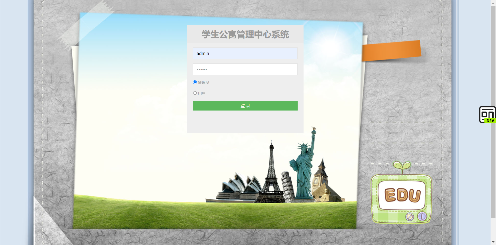
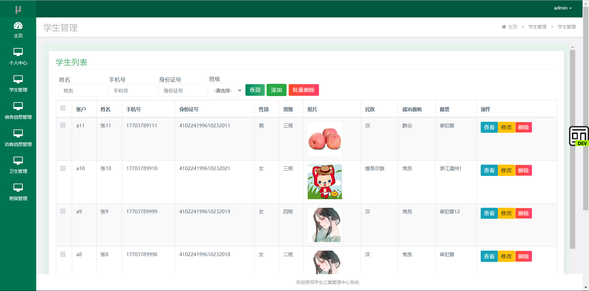
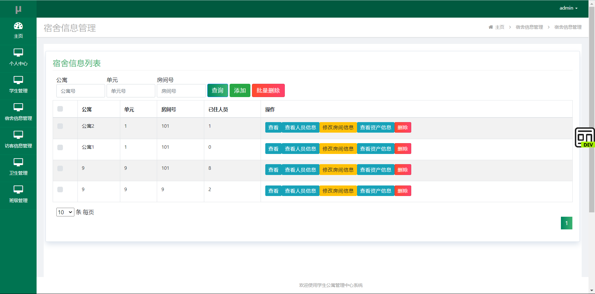
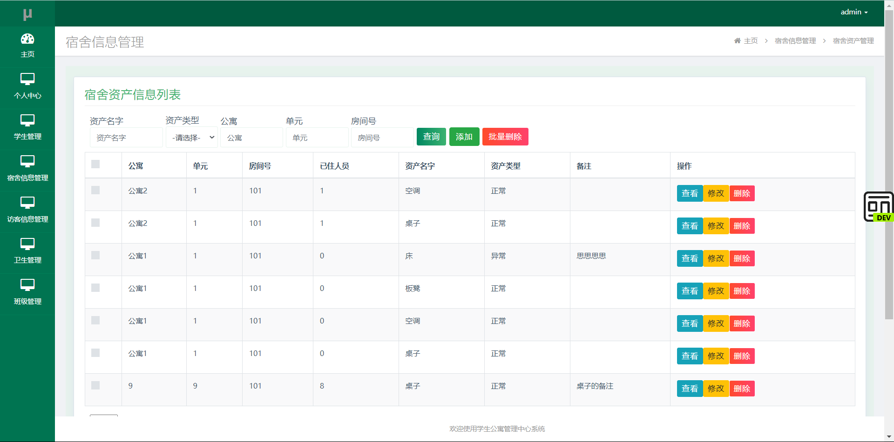
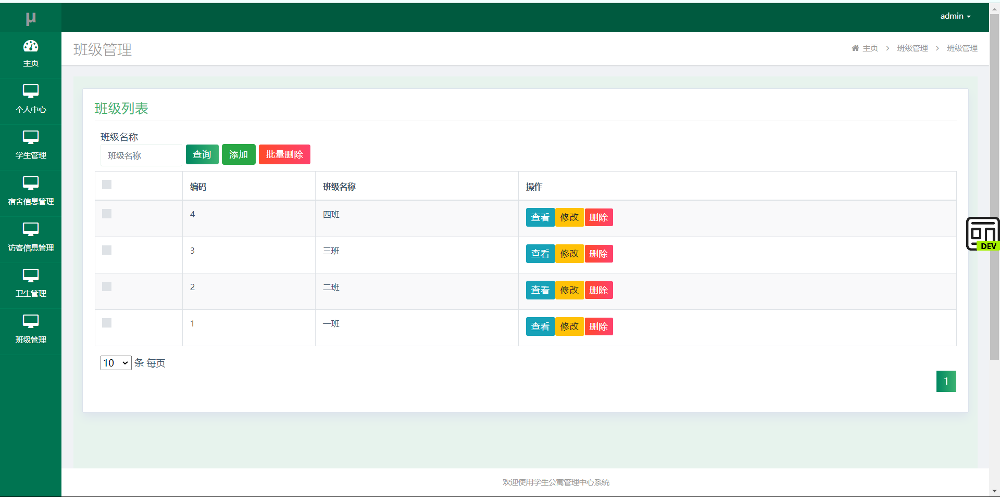
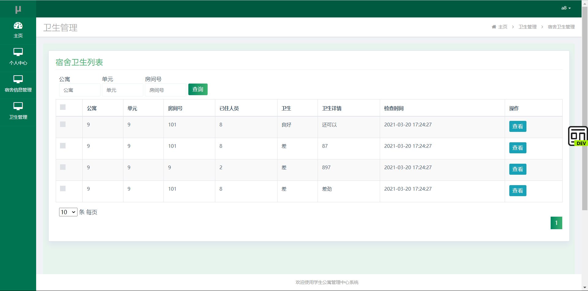

[源码目录链接:https://blog.csdn.net/Hjjshua](https://blog.csdn.net/Hjjshua)

[csdn博客地址:https://blog.csdn.net/Hjjshua?](https://blog.csdn.net/Hjjshua)

# 1.xueshenggongyu

群: 647350252

QQ: 647350252

<h1 align="center">1.学生宿舍管理系统</h1>

	
    
    
    

    
    
    
    
    
    
    

    
    
    
    
    

# 项目简介

基于ssm 的学生宿舍管理系统

# 开发环境

- <b>jdk: JDK 1.8</b>

- <b>部署工具：IntelliJ IDEA 2023.xx/Eclipse.xxx</b>

- <b>数据库：Mysql 5.7.xx/8.0.xx</b>

- <b>Tomcat: Tomcat 8.0.xx/9.0.xx</b>

# 预览图片

